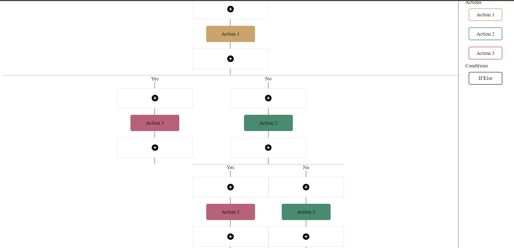

# Marketing Workflow:
A tool from where you can create marketing workflows where you can build the steps to send email, sms etc and you can also add conditional logic to define the tree. Application is made with React.js library.

## Built With
* [React](https://reactjs.org/)
* [SCSS](https://sass-lang.com/)
* [HTML5 & CSS3](https://www.w3.org/)
* [JavaScript]()

## Deployed link
* [FlowChart](https://flowchart-479e2.web.app/)


## Running locally
In the project directory, you can run:
### `npm start`
Runs the app in the development mode.\
Open [http://localhost:3000](http://localhost:3000) to view it in the browser.

### `npm run build`
Builds the app for production to the `build` folder.\
It correctly bundles React in production mode and optimizes the build for the best performance.

## Flow
Three major components:
1. ```Block``` (block for eg, send sms, email, etc. which are draggable)
2. ```Adder``` (section with + icon on which block is dropped after dragging)
3. ```Conditional``` (if/else)
for displaying the workflow.

All data is getting stored in state which is of type array. I will either contain a number or an object which properties if and else.
Example of Data Structure-
<pre>[1,2,3,{
	else:[],
	if:[3,3]
}];</pre>
1 signifies "Action1" block
2 signifies "Action2" block
3 signifies "Action3" block
Object signies a If/else condition is there.

function ```renderComp``` in ```App.js``` is handling the rendering respective components in sequence as expected.
When array has numbers, it will render ```Blocks``` with respective adders, if encounters an object, that means Conditional block, it will render ```Conditional``` component, which recusively calls ```renderComp``` function again.

There is a prop/argument ```conditionPos``` for  ```Conditional``` block and ```updateData```, which is keeping track of the if else position in the heirarchy. Data is updated in state according to conditionPos and index whose value is given by ```Adder``` component on which ```Block``` is dropped.

On data updation, as state changes, Data array will be updated in ```localStorage``` inside ```useEffect``` hook


## Know Issue
Needed CSS work on if/else block as it is not aligning with the blocks above it in nested if/else. 
